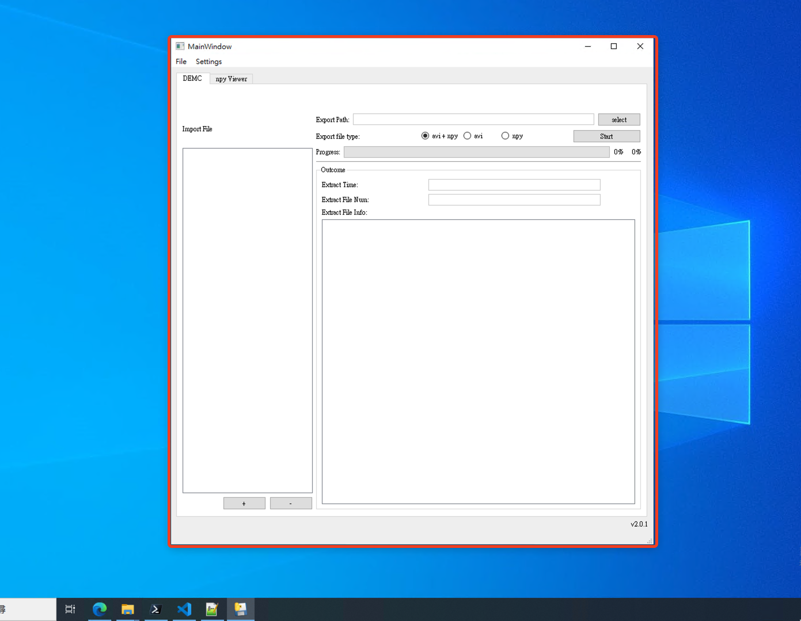

# EC_dicom2aviUiTool 使用手冊
 我已經將程式上傳至我個人的 Github ，也將程式的安裝檔發佈到 Github 上的 release ，目前最新的版本是 v2.0.1。


## Installation

以下安裝教學為 v1.1.3 的教學，不過也同樣適用目前的最新版本。

[Releases · chi-chun-1999/EC_dicom2avi (github.com)](https://github.com/chi-chun-1999/EC_dicom2avi)


- 點擊紅色區域下載最新版


- 下載帶有 `exe` 副檔名的安裝執行檔


- 下載後會發現這個執行檔可能會被 Microsoft Defender SmartScreen 視為不安全的，不過因為這個程式是我自己寫，可以確定是一定安全的。只要點擊右邊的三個點，接著點擊保留即可順利下載。


- 開啟檔案後，同樣地會發現安裝時被 Microsoft Defender SmartScreen 視為不安全，只要按下 __其他資訊__ 即可執行下載。 


- 在執行下載時，預設的安裝路徑為桌面，除此之外會在桌面建立捷徑，因此


## v2.0.0 
目前的最新版為 v2.0.1，不過最新版本的功能大致與 v2.0.0 相同，只有修改部分的 bug。

在 v2.0.0 的版本中，加入的 npy Viewer 的功能，讓使用者可以查看匯出的 npy 檔，以下文檔為 v2.0.0 使用手冊：

### 開啟程式

如果是按上面的安裝步驟，通常預設會將程式安裝在桌面，並且在 __桌面建立執行檔的捷徑__，因此只要找到這個捷徑即可打開程式。


程式順利開啟的示意圖如下所示


### 執行切出超音波心動圖中多個 cycle 的任務


如果要執行切出超音波心動圖中多個 cycle 的任務，需 __點選 "DECM" 的分頁__（下圖中箭頭所指的方向）。

<!--  -->


以下說明在 __DECM 這個分頁__ 中各個部件的功能：

- <font style="background: red">部件 1 </font>：選擇匯入具 DICOM 檔的 __資料夾__。
	- 在選取 資料夾 時需注意 __必須選取__ 具有以下的資料結構的資料夾，像是 __Echo Strain__，否則無法將資料夾下的 DICOM 檔匯入到程式中
```
Echo Strain/
├─ Strain 1/
│  ├─ GEMS_IMG/              (* GEMS_IMG資料夾)
│  │  ├─ 2009_SEP/           (*  年_月 的資料夾)
│  │  │  ├─ 23/              (*   日期 的資料夾)
│  │  │  │  ├─ __152534/     (*   __時分秒 的資料)
│  │  │  │  │  ├─ 99NFGTPC        (* dicom 檔)
├─ Strain 2/
│  ├─ GEMS_IMG/
│  │  ├─ 2019_DEC/
│  │  │  ├─ 19/
│  │  │  │  ├─ __162664/
│  │  │  │  │  ├─ 90ADGDV3         
```
- <font style="background: red">部件 2</font>：刪去匯入的 DICOM 檔或是資料夾。
	- 點擊後再按下  <font style="background: red">部件2</font> 即可刪去匯入的 DICOM 檔或是資料夾。
- <font style="background: red">部件 3</font>：與功能 1 相同，一樣為匯入具 DICOM 檔的 __資料夾__。
- <font style="background:red">部件 4</font>：程式執行相關設定。
	- <font style="background: red">部件 4-1</font>：設定執行緖的數量，基本上數量越多速度越快，但是還是要看硬體設備，有時可能會因為執行緒太多反而導致記憶體負荷過大導致執行效率變慢。
- <font style="background: red">部件 5</font>：匯出的資料夾。
	- 選取程式執行時匯出檔案 npy 檔與 avi 檔的資料夾位置。


- <font style="background: red">部件 6</font>：選擇匯出的檔案，預設為 __匯出 avi+npy 檔__。
- <font style="background: red">部件 7</font>：開始執行。


- <font style="background: red">部件 8</font>：顯示匯入的檔案。
	- 同時也可以與<font style="background: red">部件 2</font>互相搭配，選取檔案或資料夾按下<font style="background: red">部件 2</font>即可刪去。
- <font style="background: red">部件 9</font>：進度條，可以顯示目前程式的執行進度。
- <font style="background: red">部件 10</font>：顯示執行的結果。

#### 例外處理

- 當匯入資料時，選擇錯的資料夾會跳出以下錯誤訊息來提醒使用者選擇正確的資料夾。


- 如果還沒選擇匯入 DICOM 檔與選擇輸出的路徑也會跳出以下錯誤訊息。

- 執行結束後，以下的彈跳視窗主要是用來提醒使用者，DICOM 檔中那些檔案並不屬於 4 維的資料。


### npy Viewer

為了能夠讓使用者查看方便查看輸出的 npy 檔，在 v2.0.0 這個版本中加入了這個功能。然而這支程式主要是用來查看 __四維的影像資料__，否則會產生錯誤。

如果要使用 npy Viewer 的功能必須點選 __"npy Viewer"__ 的分頁，即可看到以下的畫面。


以下說明在 __npy Viewer 這個分頁__ 中各個部件的功能：
- <font style="background: red">部件 11</font>：選擇要要匯入具有 npy 檔的資料夾。
	- 在選取 資料夾 時需注意 __必須選取__ 具有以下的資料結構的資料夾，像是 __ExportData__，否則無法將資料夾下的 npy 檔匯入到程式中。
```
ExportData/
└── ac7b1825f4/
    └── 20220203/
        ├── npy/
        │   ├── KBIHSR0C_0.npy
        │   ├── KBIHSR0C_1.npy
        │   ├── KBIHSR0C_2.npy
        │   ├── KBIHSQ00_0.npy
        │   ├── KBIHSQ00_1.npy
        │   └── KBIHSQ00_2.npy
        └── whole_npy/
            ├── KBIHSR0C_whole.npy
            └── KBIHSQ00_whole.npy
```
- <font style="background: red">部件 12</font>：刪去匯入的檔案，功能與 <font style="background: red">部件 2</font> 相同。
- <font style="background: red">部件 13</font>：選擇 npy 檔的位置。
- <font style="background: red">部件 14</font>：選擇前一幀畫面。
- <font style="background: red">部件 15</font>：選擇後一幀畫面。
 


- <font style="background: red">部件 16</font>：顯示匯入的檔案。
- <font style="background: red">部件 17</font>：顯示 __四維 npy 檔各幀的畫面__。


#### 例外處理
- 當匯入資料時，選擇錯的資料夾會跳出以下錯誤訊息來提醒使用者選擇正確的資料夾。
